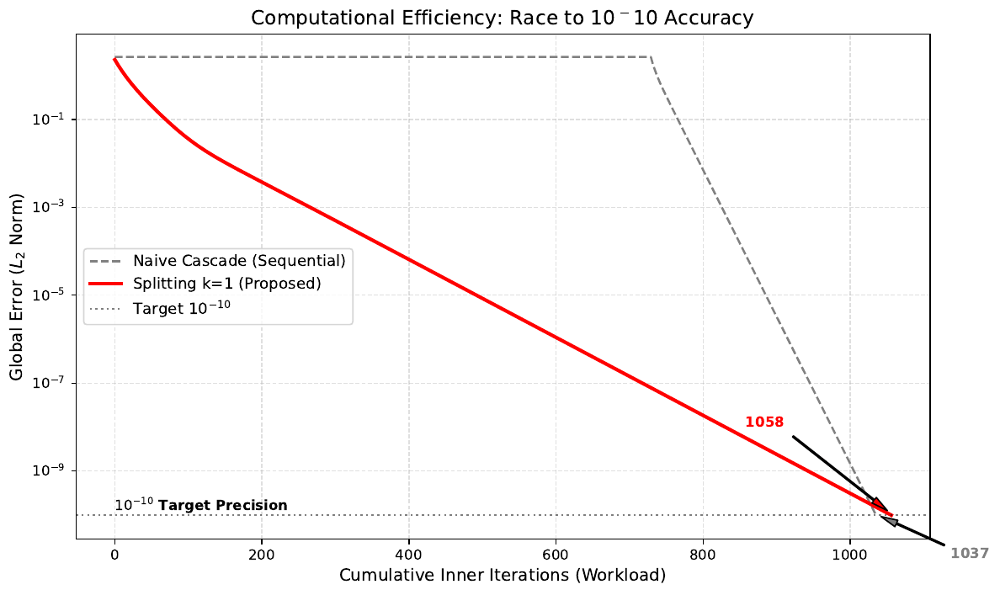
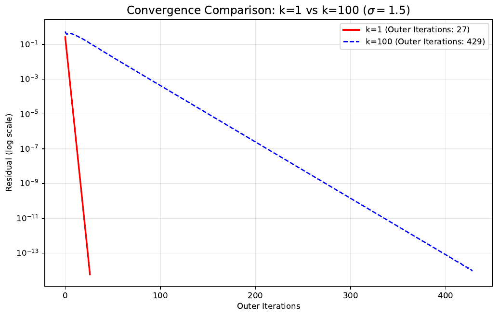

# MonDEQ Numerical Solver

A compact PyTorch implementation of the two-block projected fixed-point
iteration used in a University of Sydney 2025/26 Vacation Research Internship
investigation of cascaded monotone equilibrium networks.

This public repository contains the solver core, a deterministic usage example
and selected figures from the research project. The benchmark-generation
scripts and the complete experimental pipeline are not included.

## Scope

For each outer iteration, the implementation:

1. updates the first non-negative equilibrium state;
2. constructs a forward-coupled input from that updated state; and
3. updates the second non-negative equilibrium state.

The code uses a block step size derived from the spectral norms of
`I + alpha * H1` and `I + alpha * H2`. That calculation does not include all
coupling matrices, so convergence still depends on the supplied problem and
its mathematical assumptions. The solver reports both consecutive-state
change and the fixed-point residual of the implemented iteration map.

## Installation

Clone the repository and install it in editable mode:

```bash
git clone https://github.com/WuYefan77/MonDEQ-Numerical-Solver.git
cd MonDEQ-Numerical-Solver
python -m pip install -e .
```

Python 3.10 or later and PyTorch 2.0 or later are required.

## Quick start

```python
import torch

from mondeq_solver import MonDEQSolver

dtype = torch.float64
identity = torch.eye(2, dtype=dtype)
external_input = -torch.ones(2, 1, dtype=dtype)

solver = MonDEQSolver(alpha_base=0.1, dtype=dtype)
result = solver.solve(
    H1=identity,
    B1=identity,
    H2=identity,
    B2=identity,
    C1=identity,
    D1=identity,
    u_ext=external_input,
    sigma_val=1.5,
    target_tol=1e-12,
    return_info=True,
)

print(result.converged, result.iterations, result.residual_norm)
print(result.u, result.v)
```

The historical tuple interface remains available when `return_info` is left at
its default value:

```python
u_state, v_state = solver.solve(
    identity,
    identity,
    identity,
    identity,
    identity,
    identity,
    external_input,
)
```

By default, exhausting `max_iter` raises `ConvergenceError` instead of silently
returning an unconverged state. Set `raise_on_nonconvergence=False` together
with `return_info=True` when you want to inspect a non-converged result.

### Tensor dimensions

For first-block size `n1`, second-block size `n2`, external-input size `m` and
coupling size `q`, the required shapes are:

| Tensor | Shape |
| --- | --- |
| `H1` | `(n1, n1)` |
| `B1` | `(n1, m)` |
| `H2` | `(n2, n2)` |
| `B2` | `(n2, q)` |
| `C1` | `(q, n1)` |
| `D1` | `(q, m)` |
| `u_ext` | `(m,)` or `(m, 1)` |

All tensors must be finite floating-point values on the same device. Inputs are
converted to the solver's configured floating-point dtype.

## Selected research results

The figures below are retained outputs from the project's complete research
workflow. They document particular experimental configurations. The underlying
benchmark-generation scripts are maintained separately and are not part of
this public release.

### Workload-to-tolerance comparison



[Download the original PDF](assets/convergence_analysis.pdf)

### Inner-update comparison



[Download the original PDF](assets/speedup_1588x_benchmark.pdf)

In the reported `k=1` versus `k=100` experiment, the `1588x` figure is an
update-count comparison derived from the recorded outer-iteration counts. It
should not be interpreted as a general wall-clock or hardware speedup.

The full research poster provides the project motivation, experimental context
and references:

- [Research poster (PDF)](assets/research_poster.pdf)

## Repository layout

```text
src/mondeq_solver/   Installable solver package
examples/            Deterministic usage example
tests/               Validation and convergence tests
assets/              Selected project figures and poster
```

## Development

Install the test dependency and run the checks:

```bash
python -m pip install -e ".[test]"
python -m pytest
python examples/basic_usage.py
```

## License

Released under the [MIT License](LICENSE).
